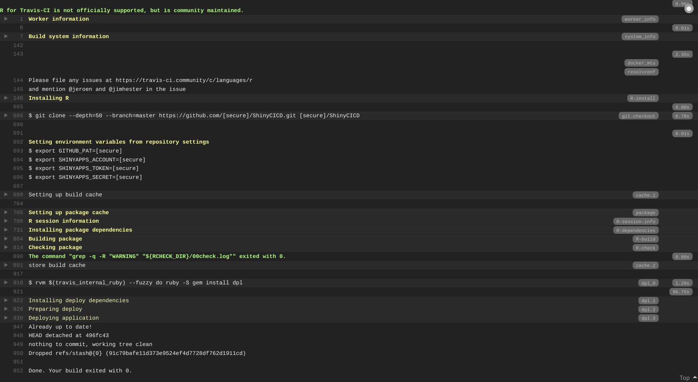
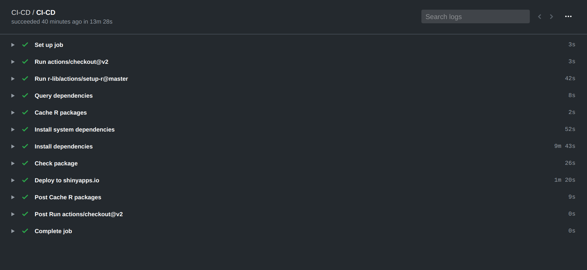

# CI/CD pypelines for automatic deployment of a R Shiny web app


It is good practice to integrate and develop an R Shiny app as an R package, to take full advantage of all the integrated features established for R packages (e.g., documentation, package namespaces, automated testing, `R CMD check`, etc.). A typical development workflow to package a Shiny app is provided by the [`golem` package](https://cran.r-project.org/web/packages/golem/index.html). Furthermore, version control systems such as Git are a great asset for keeping track an manage changes, especially in a collaborative setup.

The development od packaged Shiny app under version control can easily enable and take advantage of:

- Continuous Integration (CI) pipelines to automate checks and ensure higher code quality and robustness;
- Continuous Deployment (CD) pipelines to automate the process of deployment to a _productive_ environment.

This guide is illustrates how to set up CI/CD pipelines on the popular free and open source services [Travis CI](https://travis-ci.com) and [GitHub Actions](https://github.com/features/actions) for a packaged Shiny app on GitHub repository, deployed and hosted on [shinyapps.io](https://www.shinyapps.io). [ShinyCICD](https://github.com/miraisolutions/ShinyCICD) is a minimal example of a packaged Shiny app that will be used as an example throughout the guide. You can simply [fork](https://help.github.com/en/github/getting-started-with-github/fork-a-repo) the repository and setup your specific user settings (especially for shinyapps.io) to see CI/CD pipelines in actions, or follow the steps described below to setup CI/CD pipelines for your own app.

## Generic CI/CD pipeline

Generally speaking, a CI/CD pipeline related to an R package is comprised of the following steps:

- setup a running environment
- setup R
- check out the package source code
- install system dependencies
- install package dependencies (with caching)
- build the package
- checks the package
- deploy

Most of these steps are implemented by default in Travis CI for an R package. In GitHub Actions, on the other hand, it is currently necessary to manually specify each of them.

## Travis CI

Travis CI is an open-source continuous integration service that can be used to build and test software projects hosted on GitHub. To set up Travis CI you need to login at [https://travis-ci.com/](https://travis-ci.com/) (using your GitHub account) and provide authorization via GitHub (see [Travis CI Tutorial](https://docs.travis-ci.com/user/tutorial)).

### Standard CI setup

To setup Travis CI in a project use:


```r
usethis::use_travis() # use ext = "com" if usethis < 1.6.0
```

This will generate a generic `.travis.yml` file

```yaml
# R for travis: see documentation at https://docs.travis-ci.com/user/languages/r

language: R
cache: packages
```

As default, Travis CI takes care of package dependency installation and performs the typical package build & check you would run locally via e.g. `devtools::check()`. Such CI pipeline is triggered by any push event on any branch on the GitHub repo, including pull requests.


### Using renv for your project

If your project relies on package [renv](https://rstudio.github.io/renv) for tracking dependencies via an `renv.lock` file, you should override the default `install`ation package dependencies and make sure `cache`ing is adjusted accordingly, as follows
```yaml
cache:
  directories:
  - $HOME/.local/share/renv
  - $TRAVIS_BUILD_DIR/renv/library

install:
  - Rscript -e "if (!requireNamespace('renv', quietly = TRUE)) install.packages('renv')"
  - Rscript -e "renv::restore()"
```
as described in the [Using renv with Continuous Integration](https://rstudio.github.io/renv/articles/ci.html
) vignette.

### Automated deployment

Travis CI can be setup to perform a deployment (e.g. publish a shiny app on [shinyapps.io](https://www.shinyapps.io/)) upon any push to the `master` branch, provided the CI checks pass.

This is achieved for a shinyapps.io deployment by specifying in `.travis.yml` an additional `deploy:` section as

```yaml
deploy:
  provider: script
  skip_cleanup: true # strictly necessary only for the renv case
  script:
  - >-
    Rscript
    -e 'account_info <- lapply(paste0("SHINYAPPS_", c("ACCOUNT", "TOKEN", "SECRET")), Sys.getenv)'
    -e 'do.call(rsconnect::setAccountInfo, account_info)'
    -e 'rsconnect::deployApp(appName = "ShinyCICD")'
  on:
    branch: master
```

where `SHINYAPPS_ACCOUNT`, `SHINYAPPS_TOKEN`, `SHINYAPPS_SECRET` are [secure variables defined on Travis CI](https://docs.travis-ci.com/user/environment-variables/) holding your account name and corresponding  [tokens](https://docs.rstudio.com/shinyapps.io/getting-started.html#deploying-applications) for shinyapps.io.

It is in fact more convenient to write an R script, saved e.g. as `deploy/deploy-shinyapps.R` (build-ignored via `usethis::use_build_ignore("deploy")`) defining the deployment commands:


```r
# deploy/deploy-shinyapps.R
# usethis::use_build_ignore("deploy")
rsconnect::setAccountInfo(
  Sys.getenv("SHINYAPPS_ACCOUNT"),
  Sys.getenv("SHINYAPPS_TOKEN"),
  Sys.getenv("SHINYAPPS_SECRET")
)
rsconnect::deployApp(
  appName = "ShinyCICD",
  # exclude hidden files and renv directory (if present)
  appFiles = setdiff(list.files(), "renv")
)
```
and then simply execute it as `deploy` `script`:
```yml
deploy:
  provider: script
  skip_cleanup: true # strictly necessary only for the renv case
  script: Rscript deploy/deploy-shinyapps.R
  on:
    branch: master
```


### Putting it all together

The final `.travis.yml` file (for the non-renv case) would look like

```yaml
# R for travis: see documentation at https://docs.travis-ci.com/user/languages/r

language: R
cache: packages

deploy:
  provider: script
  script: Rscript deploy/deploy-shinyapps.R
  on:
    branch: master
```

As visible from the run logs, all the CI/CD pipeline steps are performed, despite only the deployment step being explicitly defined.




## GitHub Actions

[GitHub Actions](https://help.github.com/en/actions) is a service for running highly-customizable and flexible automated workflows, fully integrated with GitHub and very suitable to CI/CD pipelines.
[Workflows](https://help.github.com/en/actions/configuring-and-managing-workflows/configuring-a-workflow) use `YAML` syntax and should be stored in the `.github/workflows` directory in the root of the repository.
Workflows are constituted of jobs and each job is a set of steps to perform individual tasks, e.g. commands or actions.

### Workflow steps

A workflow should have an identifying `name` and an `on` section indicating upon which events the workflow should be triggered. It should include at least one job and each job will have a set of steps fully specifying what to execute. Such steps can be a (predefined) action or a script, however, for the time being, GitHub Actions does not support a hierarchical, aggregated structure of actions. Being fully customizable, it is necessary to fully specify each step in the CI/CD pipeline explicitly.

#### Setup

- Checkout the source package from the repo, using `actions/checkout` provided by GitHub.
- Setup R using action [`r-lib/actions/setup-r`](https://github.com/r-lib/actions#readme)
- Query and cache R package dependencies using `remotes::dev_package_deps()` and the `actions/cache` predefined action.
- Install system dependencies using package `sysreqs::sysreq_commands()` (for the `ubuntu` runner used to run the action)
- Install R package dependencies using `remotes::Install_deps()`

#### Package check

- Check the package via using `rcmdcheck::rcmdcheck()`

#### Deployment

- Deploy to shinyapps.io, similar to the Travis CI case
  - In this case, environment variables `SHINYAPPS_ACCOUNT`, `SHINYAPPS_TOKEN` and `SHINYAPPS_SECRET`, defining credentials for [shinyapps.io](https://www.shinyapps.io/)), are specified / accessible as GitHub [secrets](https://help.github.com/en/actions/configuring-and-managing-workflows/using-variables-and-secrets-in-a-workflow).
  - An R script e.g. `deploy/deploy-shinyapps.R` (build-ignored via `usethis::use_build_ignore("deploy")`) defines the deployment commands based on the environment variables:
  
  ```r
  # deploy/deploy-shinyapps.R
  # usethis::use_build_ignore("deploy")
  rsconnect::setAccountInfo(
    Sys.getenv("SHINYAPPS_ACCOUNT"),
    Sys.getenv("SHINYAPPS_TOKEN"),
    Sys.getenv("SHINYAPPS_SECRET")
  )
  rsconnect::deployApp(
    appName = "ShinyCICD",
    # exclude hidden files and renv directory (if present)
    appFiles = setdiff(list.files(), "renv")
  )
  ```


### Workflow file

The `steps` above are defined in the `.yml` workflow file as follows


```yml
# Triggered on push and pull request events
on: [push, pull_request]

# Name of the workflow => usethis::use_github_actions_badge("CI-CD")
name: CI-CD

jobs:
  CI-CD:
    runs-on: ubuntu-latest

    steps:

      - uses: actions/checkout@v2

      - uses: r-lib/actions/setup-r@master

      - name: Query dependencies
        shell: Rscript {0}
        run: |
          install.packages('remotes')
          saveRDS(remotes::dev_package_deps(dependencies = TRUE), ".github/depends.Rds", version = 2)
          writeLines(sprintf("R-%i.%i", getRversion()$major, getRversion()$minor), ".github/R-version")

      - name: Cache packages
        uses: actions/cache@v2
        with:
          path: ${{ env.R_LIBS_USER }}
          key: ${{ runner.os }}-${{ hashFiles('.github/R-version') }}-${{ hashFiles('.github/depends.Rds') }}
          restore-keys: |
            ${{ runner.os }}-${{ hashFiles('.github/R-version') }}-

      - name: Install system dependencies
        env:
          RHUB_PLATFORM: linux-x86_64-ubuntu-gcc
        run: |
          Rscript -e "remotes::install_github('r-hub/sysreqs')"
          sysreqs=$(Rscript -e "cat(sysreqs::sysreq_commands('DESCRIPTION'))")
          sudo -s eval "$sysreqs"

      - name: Install dependencies
        shell: Rscript {0}
        run: remotes::install_deps(dependencies = TRUE)

      - name: Check package
        shell: Rscript {0}
        run: |
          install.packages("rcmdcheck")
          rcmdcheck::rcmdcheck(args = "--no-manual", error_on = "warning")

      - name: Deploy to shinyapps.io
        if: github.ref == 'refs/heads/master'
        env:
          SHINYAPPS_ACCOUNT: ${{ secrets.SHINYAPPS_ACCOUNT }}
          SHINYAPPS_TOKEN: ${{ secrets.SHINYAPPS_TOKEN }}
          SHINYAPPS_SECRET: ${{ secrets.SHINYAPPS_SECRET }}
        run: Rscript deploy/deploy-shinyapps.R
```

As visible from the run logs, all the CI/CD pipeline steps are performed subsequently, and are identifiable by the `name` field.



### `usethis::use_github_action()`

In order to use the GitHub action workflow above, or its renv-based variant, you can simply:

```r
usethis::use_github_action(
  url = 
    "https://mirai-solutions.ch/techguides/shiny-ci-cd/actions/ci-cd.yml"
  # "https://mirai-solutions.ch/techguides/shiny-ci-cd/actions/ci-cd-renv.yml"
  # "https://mirai-solutions.ch/techguides/shiny-ci-cd/actions/ci.yml"
  # "https://mirai-solutions.ch/techguides/shiny-ci-cd/actions/ci-renv.yml"
)
usethis::use_github_actions_badge("CI-CD") # or "CI"
```
